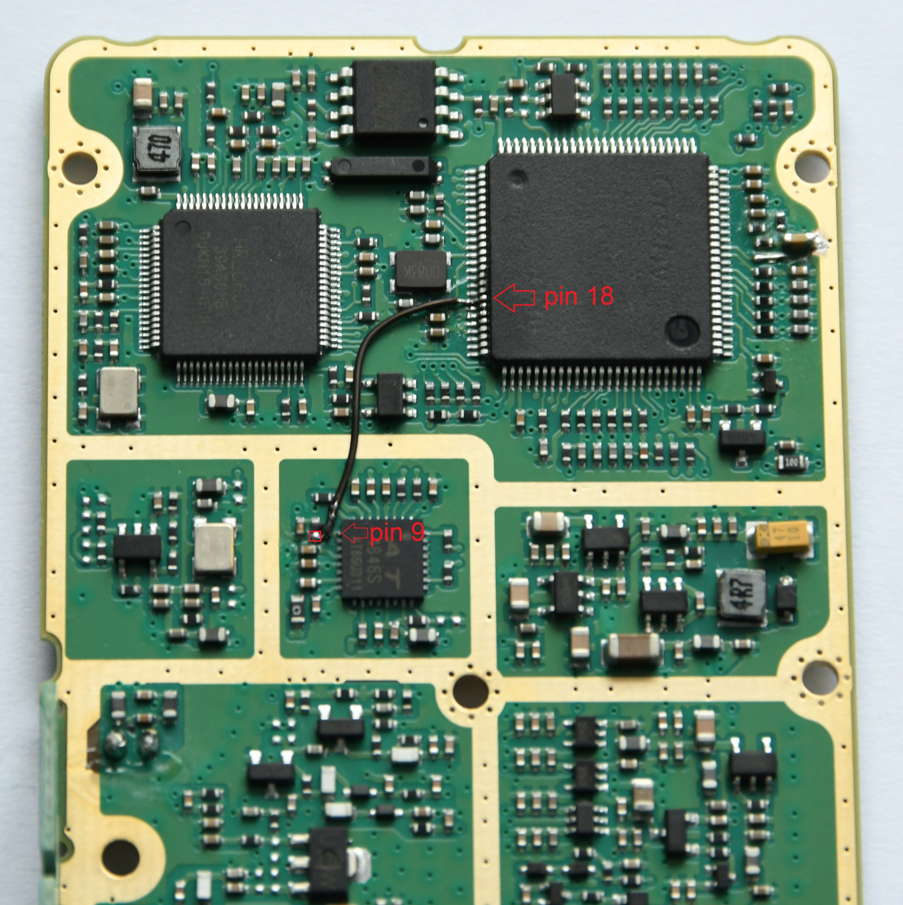
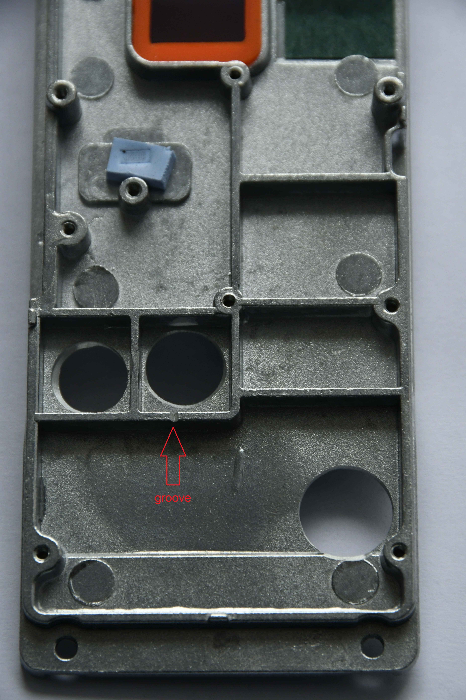
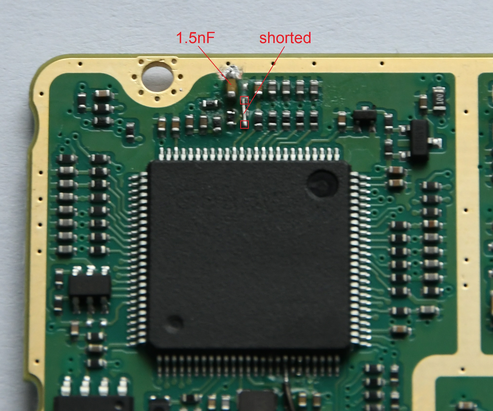
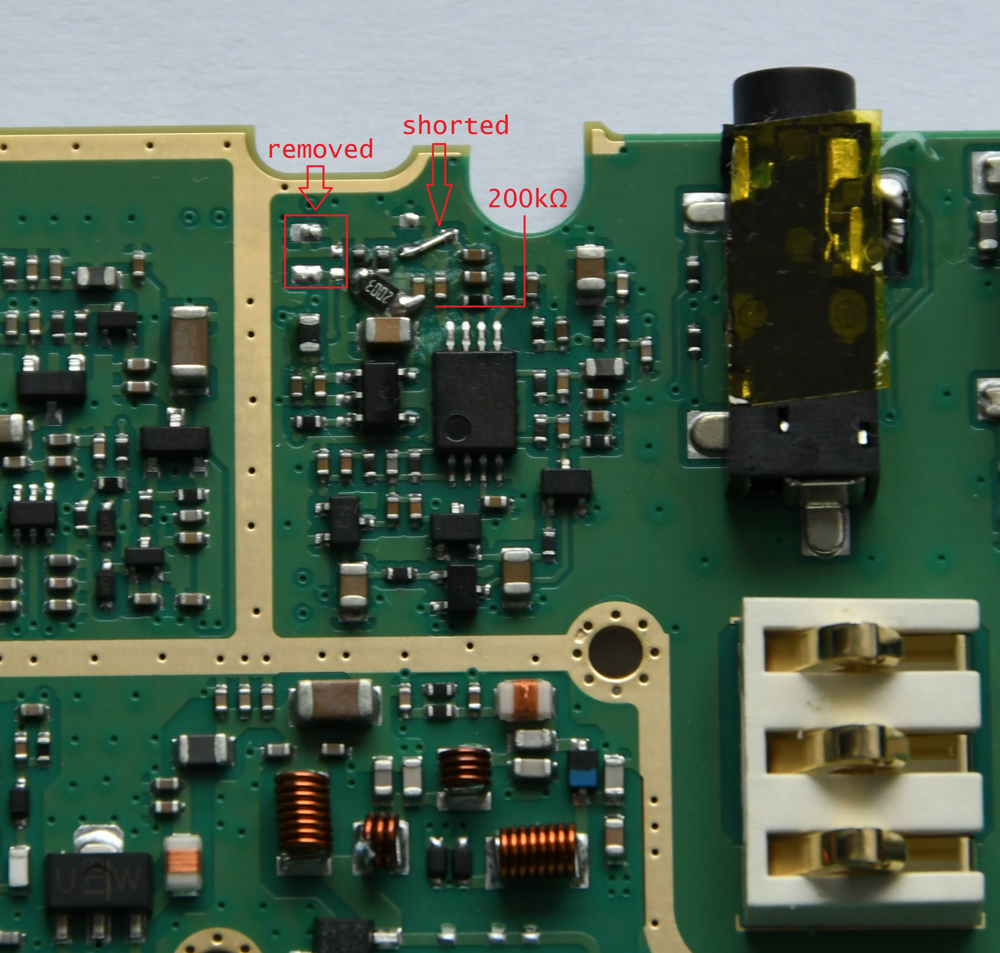
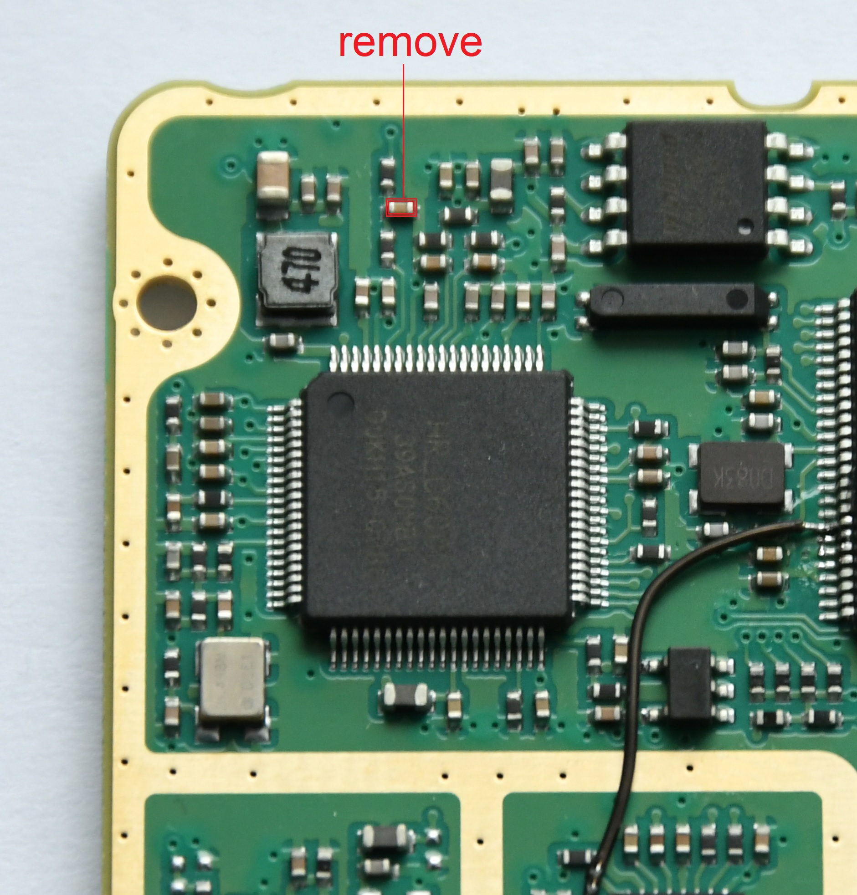

# DM-1701_mod
A modification guide for the [Baofeng DM-1701](https://www.baofengradio.com/products/dm-1701) dual-band, 5W DMR radio, enabling M17 support.

## Overview
The modification requires adding a 200k resistor (220k is fine too), a 1.5nF capacitor (1nF is fine too; both SMD, 0805 size is perfect) and a piece of Kynar wire.

## Modification
Required tools:
* flat screwdriver (3mm)
* Torx T8 screwdriver
* Philips PH0 screwdriver
* bent pliers
* small, triangular file
* soldering iron and its friends: solder, solder wick, flux
* some patience

 1. **Disassemble the radio.**
* unscrew the antenna
* remove both knobs located at the top of the unit by pulling them upwards (using a flat screwdriver can help here)
* unscrew all 3 nuts using bent pliers
* remove all 4 screws at the back using the Torx screwdriver
* remove the plastic cover at the top of the back side of the radio
* pry the metal chassis out of the radio using a flat screwdriver at the bottom. Be careful: pull gently, as the mainboard is connected to
the speaker glued to the plastic front of the radio
* remove all the screws (about 10, including 2 holding the display's frame, all with Philips heads)
* release the display ribbon by pulling out the plastic latch towards the screen and disconnect it from the PCB
* remove solder from the pad holding the antenna connector's center pin in place
* separate the PCB from the aluminum chassis

At this point you should have gained access to both sides of the mainboard. Now the fun begins, so buckle up and let's go. 
 2. **Connect MCU's pin 18 with AT1846's pin 9.** 
Using a piece of Kynar wire, simply connect these two pins together.

 3. **Note where the Kynar wire goes and, using a triangular file, make a small groove in the aluminum chassis.** 
Be sure to remove all the metal dust, as it may cause problems (shorts). Disregard the three large round holes, they are not required.

 4. **Remove two SMD resistors and a capacitor just next to them.** 
Short the pads shown in the photo and mount a 1.5nF capacitor. If 0805 size capacitor is used, mount it on its side.
Scraping off some soldermask might be required, as there's little space available.

 5. **Short the resistor shown and remove the capacitor next to it.**

 6. **Remove two capacitors and a dual diode in SOT-23. Short out pads as shown below.** 
Use a 200k resistor to connect one of the resistors with a capacitor close to it.

 7. **Remove the capacitor close to the HR_C6000 chip.**

 8. **Re-assemble the radio.** 
Test the connections and clean all the flux residual, if necessary. Reverse the procedure from point **1**.
Make sure the groove in the chassis is in the right place, otherwise the chassis might pinch the wire's insulation and cause problems.

## Flashing with OpenRTX
> [!WARNING]
> Keep in mind that the DM-1701 support is still under active development and might not offer all M17 and/or device's functionalities.

Flashing process is straightforward and is the same as for any other OpenRTX supported handheld transceivers.
Under Linux, it is possible to use [a handy Bash script](https://gist.github.com/sp5wwp/bd1890cebab4ae7e5bd3ae052f3d4f5d) to do the task. Windows - WIP.
Please visit the OpenRTX project's homepage at [openrtx.org](https://openrtx.org) for more details.
